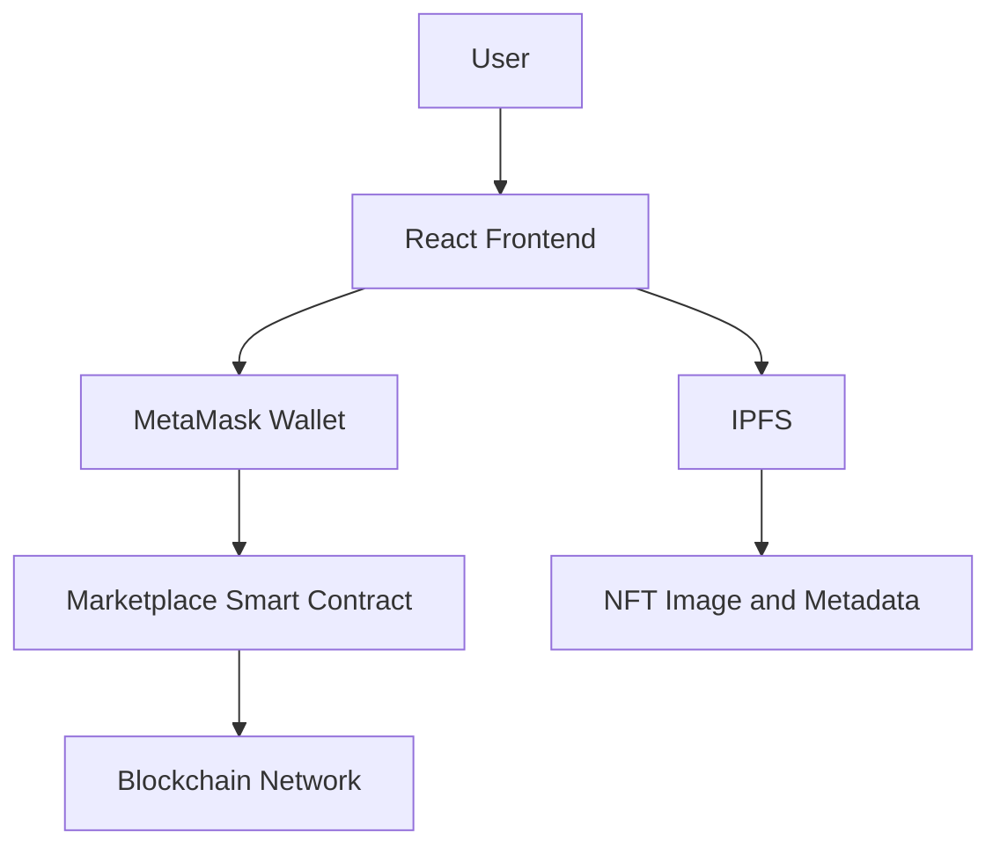

# 🖼️ NFT Marketplace DApp

A decentralized NFT Marketplace built with React, Solidity, Hardhat, ethers.js, MetaMask, and IPFS.

This platform allows users to create, mint, list, buy, and manage NFTs directly on the blockchain without depending on a centralized marketplace.

---

## 🌐 Live Application

🔗 **Live Demo:** [Add your live website URL]

🔗 **Frontend Repository:** [Add frontend repository URL]

🔗 **Smart Contract Repository:** [Add smart contract repository URL]

🔗 **Contract on Explorer:** [Add Etherscan/Polygonscan URL]

---

## 📌 About The Project

Traditional digital marketplaces require centralized platforms to manage NFT ownership, transactions, and user data.

This project solves that problem by using blockchain technology. NFT ownership and marketplace transactions are handled through Solidity smart contracts, while NFT images and metadata are stored on IPFS.

The application provides a transparent and decentralized way for creators and collectors to interact with digital assets.

---

## ✨ Features

### Wallet Features

- Connect wallet with MetaMask.
- Detect connected wallet address.
- Detect incorrect blockchain network.
- Request network switching when required.
- Display wallet balance.

### NFT Features

- Create and mint NFTs.
- Upload NFT images to IPFS.
- Store NFT metadata on IPFS.
- Display NFT name, description, image, creator, and price.
- View NFT details.
- View NFTs owned by the connected wallet.
- View NFTs created by the connected wallet.

### Marketplace Features

- List NFT for sale.
- Buy listed NFTs.
- Cancel NFT listing.
- Update NFT price.
- Transfer NFT ownership after purchase.
- Receive payment through blockchain transactions.
- Display marketplace transaction status.

### User Experience

- Responsive design.
- Modern and clean interface.
- Loading state during blockchain transactions.
- Error handling for rejected transactions.
- Transaction success notifications.
- Mobile-friendly NFT cards.
- Empty-state screens for better usability.

---

## 🛠️ Tech Stack

| Category | Technology |
|---|---|
| Frontend | React.js |
| Build Tool | Vite |
| Styling | Tailwind CSS |
| Smart Contracts | Solidity |
| Development Framework | Hardhat |
| Blockchain Library | ethers.js |
| Wallet | MetaMask |
| NFT Standard | ERC-721 |
| File Storage | IPFS |
| IPFS Provider | Pinata |
| Network | Sepolia Testnet |
| Version Control | Git and GitHub |

---

## 🏗️ Application Architecture



### Transaction Flow

```text
User connects MetaMask
        ↓
User uploads NFT image
        ↓
Image is stored on IPFS
        ↓
NFT metadata is created
        ↓
Metadata is stored on IPFS
        ↓
Smart contract mints NFT
        ↓
NFT can be listed for sale
        ↓
Buyer purchases NFT
        ↓
Ownership is transferred on-chain
```

---

## 📂 Project Structure

```text
nft-marketplace/
│
├── client/
│   ├── public/
│   ├── src/
│   │   ├── assets/
│   │   ├── components/
│   │   │   ├── Navbar.jsx
│   │   │   ├── NFTCard.jsx
│   │   │   ├── Loader.jsx
│   │   │   └── WalletButton.jsx
│   │   ├── pages/
│   │   │   ├── Home.jsx
│   │   │   ├── CreateNFT.jsx
│   │   │   ├── MyNFTs.jsx
│   │   │   ├── MyListings.jsx
│   │   │   └── NFTDetails.jsx
│   │   ├── contracts/
│   │   │   ├── NFT.json
│   │   │   └── Marketplace.json
│   │   ├── utils/
│   │   │   ├── contract.js
│   │   │   ├── ipfs.js
│   │   │   └── formatters.js
│   │   ├── App.jsx
│   │   ├── main.jsx
│   │   └── index.css
│   ├── package.json
│   └── vite.config.js
│
├── contracts/
│   ├── NFT.sol
│   └── Marketplace.sol
│
├── scripts/
│   └── deploy.js
│
├── test/
│   ├── NFT.test.js
│   └── Marketplace.test.js
│
├── deployments/
│   └── addresses.json
│
├── hardhat.config.js
├── package.json
├── .env.example
├── .gitignore
├── LICENSE
└── README.md
```

---

## 🔐 Smart Contracts

### NFT Contract

The NFT contract follows the ERC-721 standard and is responsible for creating and managing NFT ownership.

Main responsibilities:

- Mint new NFTs.
- Store token URI.
- Track NFT ownership.
- Transfer NFT ownership.
- Approve marketplace contract.

### Marketplace Contract

The marketplace contract handles NFT listings and purchases.

Main responsibilities:

- Create NFT listings.
- Store NFT price.
- Validate listing ownership.
- Process NFT purchases.
- Transfer NFT ownership.
- Send payment
